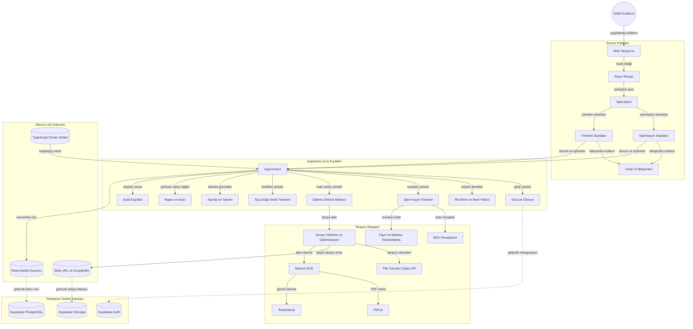
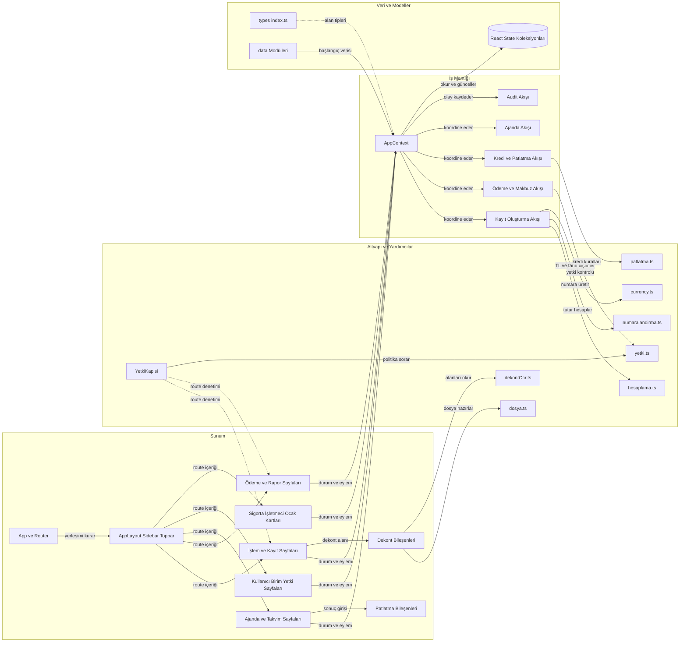
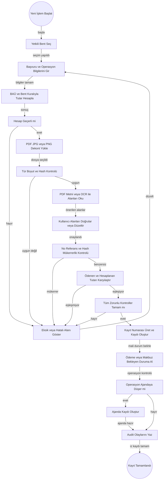
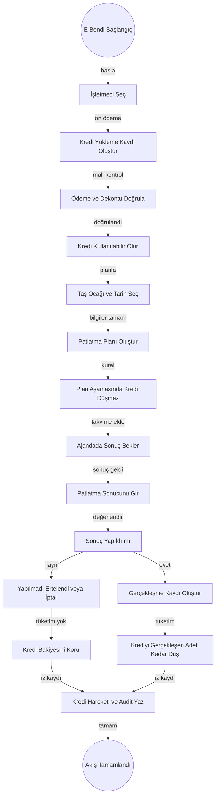

# KTPGV Mimari Diyagramları ve İş Akışları

Bu belge, KTPGV uygulamasının mevcut React tabanlı prototip mimarisini, ana bileşen ilişkilerini ve kritik iş akışlarını Türkçe olarak görselleştirir. Diyagramlar çalışan tarayıcı içi yapıyı gösterir; henüz uygulanmamış hedef Supabase mimarisi ayrıca belirtilir.

## Uygulama Mimarisi

<!-- mermaid-checked: no \n, no em-dash/en-dash, no {} in labels, subgraphs are id["label"], arrows are -->|"label"|, all subgraphs closed by end, ids unique -->

### Teknoloji Yığını Özeti

| Katman | Teknoloji | Sürüm | Görevi | Mevcut Durum |
|---|---|---:|---|---|
| Derleme | Vite | 5.2.x | Geliştirme sunucusu ve üretim paketi | Kullanılıyor |
| Arayüz | React | 18.3.x | Sayfa, form, yerleşim ve bileşen sunumu | Kullanılıyor |
| Yönlendirme | React Router DOM | 6.26.x | Tarayıcı route yapısı ve sayfa geçişleri | Kullanılıyor |
| Dil | TypeScript | 5.5.x | Sıkı tip kontrolü ve alan modelleri | Kullanılıyor |
| Stil | Tailwind CSS | 3.4.x | Yardımcı sınıf tabanlı tasarım sistemi | Kullanılıyor |
| Bildirim | Sonner | 2.0.x | Başarı, hata ve uyarı bildirimleri | Kullanılıyor |
| İkon | Lucide React | 0.522.x | Arayüz ikonları | Kullanılıyor |
| Uygulama durumu | React Context ve hook yapısı | 18.3.x | Merkezi bellek durumu, eylemler ve filtreli görünümler | Kullanılıyor |
| Yetkilendirme | Özel route ve veri kontrolleri | Proje kodu | Rol, birim, menü, bent, kayıt ve eylem denetimi | Tarayıcı içinde |
| Hesaplama | Özel TypeScript yardımcıları | Proje kodu | BAÜ oranları, tutar ve girdi doğrulama | Tarayıcı içinde |
| Belge işleme | PDF.js | 6.2.x | PDF metni ve sayfa görseli çıkarma | Tarayıcı içinde |
| OCR | Tesseract.js | 7.0.x | Türkçe ve İngilizce dekont metni tanıma | Tarayıcı içinde |
| Dosya işleme | File, Canvas ve Web Crypto API | Tarayıcı | Yükleme, önizleme, optimizasyon ve SHA-256 özeti | Tarayıcı içinde |
| Hedef kimlik | Supabase Auth | Planlanan | Merkezi kullanıcı oturumu | Henüz bağlı değil |
| Hedef veritabanı | Supabase PostgreSQL | Planlanan | Çok kullanıcılı kalıcı veri ve benzersizlik | Henüz bağlı değil |
| Hedef dosya deposu | Supabase Storage | Planlanan | Dekont ve rapor dosyalarının kalıcı saklanması | Henüz bağlı değil |

### Veri Saklama ve Dış Servisler

Mevcut çalışan uygulamada backend, kalıcı veritabanı, cache, mesaj kuyruğu veya uzak API bağlantısı yoktur. `src/data` altındaki TypeScript örnek verileri `AppContext` durumunu başlatır; kullanıcı işlemleri yalnızca açık tarayıcı oturumundaki React belleğinde tutulur ve sayfa yenilendiğinde başlangıç durumuna döner. Dekont dosyaları Blob URL ve `ArrayBuffer` olarak geçici biçimde işlenir. PDF.js ve Tesseract.js tarayıcıda çalışır; OCR sonucu tek başına ödeme doğrulaması sayılmaz.

Hedef üretim yönü Supabase Auth, PostgreSQL ve Storage kullanımıdır. Kayıt ve makbuz numarası benzersizliği, rol ve birim yetkileri, mali kayıtlar, audit izi ve dosya saklama üretimde sunucu ve veritabanı seviyesinde güvence altına alınmalıdır.

### Temel Mimari Kararlar

- `AppContext`, kullanıcı, birim, işlem, ödeme, ajanda, kredi, audit ve ana kart verileri için merkezi uygulama cephesidir.
- Menü görünürlüğü, route erişimi, kayıt görünürlüğü ve işlem yapma yetkisi ayrı ayrı denetlenir.
- Sayfalar iş akışını yönetir; hesaplama, numaralandırma, yetki, dosya ve OCR işlemleri yardımcı modüllere ayrılmıştır.
- Mevcut veri katmanı prototip amaçlı ve geçicidir; çok kullanıcılı üretim garantisi sağlamaz.
- Ana mali kural korunur: ödeme ve dijital dekont kontrolü tamamlanmadan ödeme gerektiren işlem tamamlanamaz.

## Bileşen İlişkileri

<!-- mermaid-checked: no \n, no em-dash/en-dash, no {} in labels, subgraphs are id["label"], arrows are -->|"label"|, all subgraphs closed by end, ids unique -->

### Bileşen Envanteri

| Bileşen | Katman | Tür | Temel Sorumluluk | Bağlı Olduğu Alan |
|---|---|---|---|---|
| `App.tsx` | Sunum | Uygulama kabuğu | Kullanıcı durumuna göre giriş veya route ağacını açar | Tüm uygulama |
| `AppLayout` | Sunum | Yerleşim | Sidebar, Topbar ve sayfa içeriğini bir araya getirir | Tüm yetkili ekranlar |
| `YetkiKapisi` | Sunum ve güvenlik | Route koruyucu | URL elle yazılsa bile yetkisiz ekranı engeller | Route erişimi |
| İşlem ve kayıt sayfaları | Sunum | Sayfa grubu | Yeni işlem oluşturma, kayıt listeleme ve detay görüntüleme | A, B, C, Ç, D, E, F bentleri |
| Ödeme ve rapor sayfaları | Sunum | Sayfa grubu | Mali kayıt, makbuz, rapor, arşiv ve audit görünümleri | Mali ve denetim süreçleri |
| Ajanda ve takvim sayfaları | Sunum | Sayfa grubu | Operasyon tarihleri ve patlatma sonuçlarını yönetir | C, Ç, D, E, F bentleri |
| Yönetim sayfaları | Sunum | Sayfa grubu | Kullanıcı, birim, menü, bent ve işlem yetkilerini yönetir | Yetkilendirme |
| Ana kart sayfaları | Sunum | Sayfa grubu | Sigorta şirketi, işletmeci ve taş ocağı kartlarını yönetir | F Trafik ve E bendi |
| `DekontBolumu` | Sunum | Özellik bileşeni | Dosya yükleme, OCR, alan kontrolü ve mükerrerlik uyarısı sağlar | Ödeme gerektiren kayıt |
| Patlatma bileşenleri | Sunum | Özellik bileşeni | Plan, yapıldı, yapılmadı, ertelendi ve iptal sonuçlarını alır | E bendi |
| `AppContext` | İş mantığı | Merkezi context | Durumu, eylemleri, sorguları, filtreli görünümleri ve audit akışını sunar | Tüm modüller |
| Kayıt oluşturma akışı | İş mantığı | Alan iş akışı | Ön koşulları doğrular, kayıt numarası üretir ve ilgili ajanda kaydını açar | Yeni işlem |
| Ödeme ve makbuz akışı | İş mantığı | Alan iş akışı | Dekont kanıtı, ödeme doğrulama ve makbuz durumlarını yönetir | Mali süreç |
| Kredi ve patlatma akışı | İş mantığı | Alan iş akışı | Kredi yükleme, planlama, sonuç ve tüketim hareketlerini yönetir | E bendi |
| Ajanda akışı | İş mantığı | Alan iş akışı | Operasyon tarihini, durumunu ve sonuç kaydını izler | Operasyonel bentler |
| Audit akışı | İş mantığı | Çapraz kesen işlev | Giriş, kayıt, ödeme, yönetim ve uyarı olaylarını kaydeder | Tüm kritik işlemler |
| `yetki.ts` | Altyapı | Politika fonksiyonları | Rol, birim, bent, menü, kayıt ve eylem yetkisini hesaplar | Güvenlik |
| `hesaplama.ts` | Altyapı | Alan yardımcıları | BAÜ tabanlı bedelleri ve sayısal doğrulamaları hesaplar | C, Ç, D, E, F |
| `numaralandirma.ts` | Altyapı | Alan yardımcıları | Kayıt, alt rapor ve makbuz numaralarını üretir | Kayıt süreçleri |
| `dosya.ts` | Altyapı | Tarayıcı adaptörü | Tür ve boyut kontrolü, görsel optimizasyonu ve SHA-256 üretir | Dekont ve belge |
| `dekontOcr.ts` | Altyapı | Belge adaptörü | PDF metni çıkarır, görsel OCR yapar ve alanları ayrıştırır | Dekont |
| `types/index.ts` | Veri | Alan modeli | Kullanıcı, işlem, dekont, kredi, ajanda ve ana kart tiplerini tanımlar | Tüm uygulama |
| `src/data` modülleri | Veri | Örnek veri kaynağı | Uygulamanın başlangıç koleksiyonlarını sağlar | Prototip |
| React state koleksiyonları | Veri | Geçici veri deposu | Oturum süresince kullanıcı değişikliklerini bellekte tutar | Prototip |

## Kritik İş Akışları

### Ödeme, Dekont ve Kayıt Akışı

Bu akış ödeme gerektiren standart işlem ve E bendi kredi yükleme kayıtlarında uygulanan temel kontrol sırasını gösterir.

<!-- mermaid-checked: no \n, no em-dash/en-dash, no {} in labels, subgraphs are id["label"], arrows are -->|"label"|, all subgraphs closed by end, ids unique -->

### Taş Ocağı Kredi ve Patlatma Akışı

E bendinde ödeme, kredi yükleme, planlama ve gerçekleşme birbirinden ayrılır. Kredi planlama sırasında değil, yalnızca patlatma sonucu `Yapıldı` olarak işlendiğinde tüketilir.

<!-- mermaid-checked: no \n, no em-dash/en-dash, no {} in labels, subgraphs are id["label"], arrows are -->|"label"|, all subgraphs closed by end, ids unique -->

### Akışlarda Korunan İş Kuralları

- **BR-001 ve BR-015:** Ödeme ve dijital dekont olmadan ödeme gerektiren kayıt tamamlanmaz.
- **BR-002:** Dekont ödeme kanıtıdır; makbuzdan farklı bir kayıt türüdür.
- **BR-004 ve BR-005:** Tutarlar TL olarak gösterilir ve BAÜ merkezi hesaplama girdisidir.
- **BR-006:** Rol ve birim kontrolleri yalnızca menü gizlemeye bırakılmaz.
- **BR-008:** Kayıt ve makbuz numaraları üretimde veritabanı seviyesinde benzersiz olmalıdır.
- **BR-012 ve BR-013:** Ön ödeme kredi üretir; aynı işletmeciye bağlı ocaklar ortak kredi havuzunu kullanır.
- **E bendi sonucu:** Planlama kredi düşürmez; yalnızca `Yapıldı` sonucu kredi tüketir.
